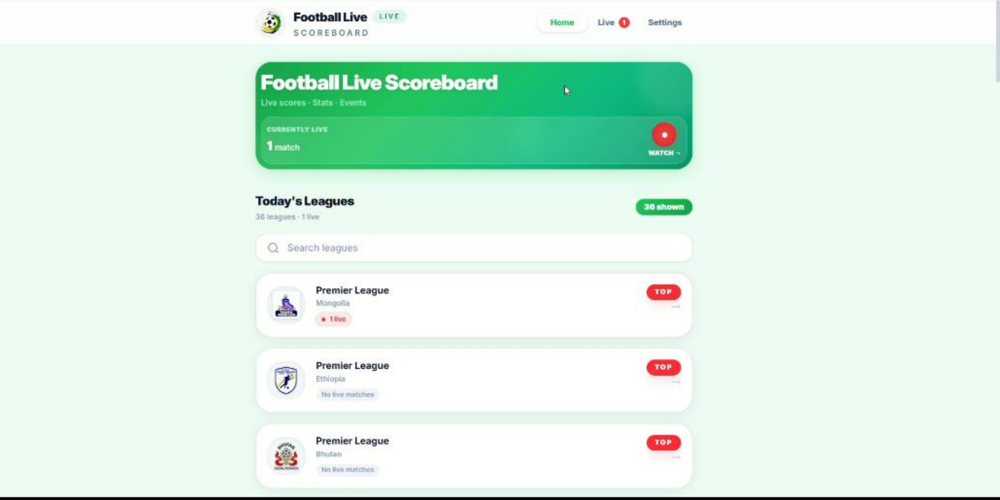
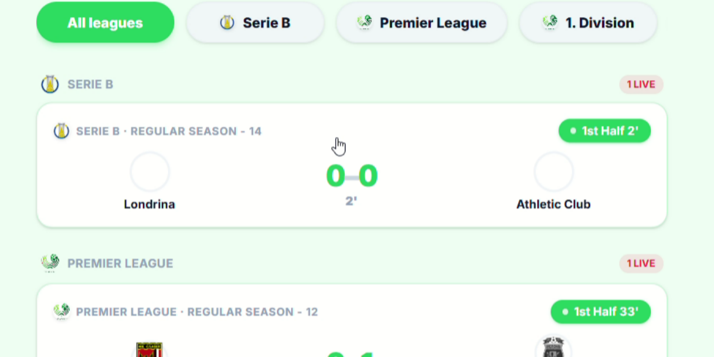
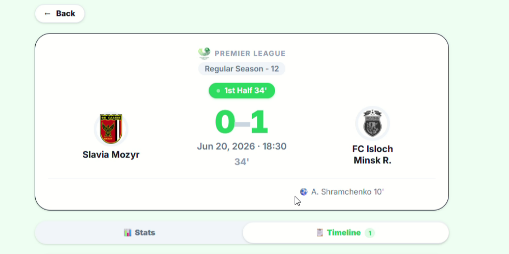
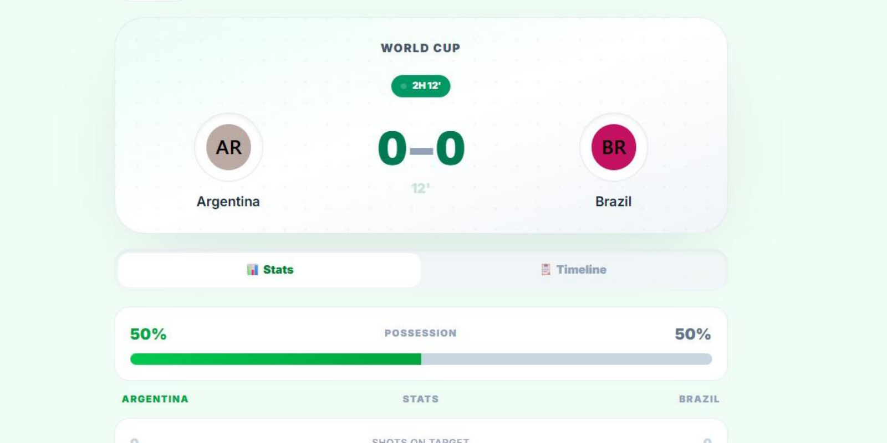
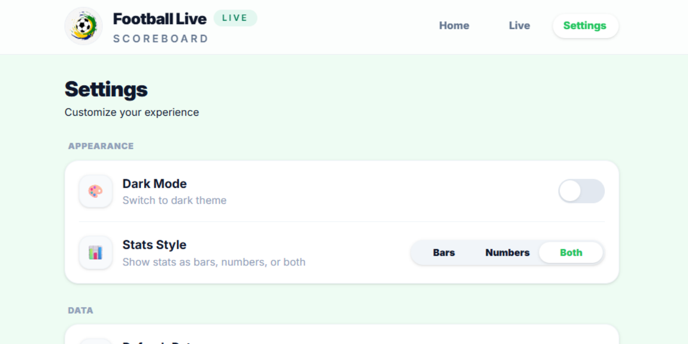
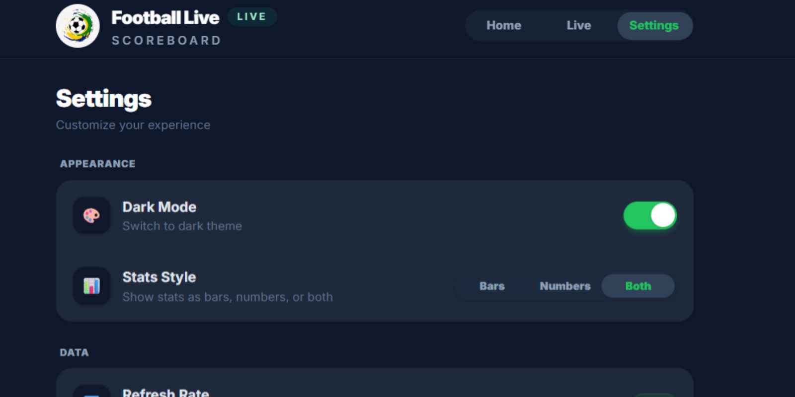

<div align="center">

# ⚽ Football Live Scoreboard

**Real-time football live scores, leagues & match statistics**

Full-stack app with React, Node.js, Express, Socket.IO, and [API-Football v3](https://dashboard.api-football.com/login) - live scores, today's fixtures, goals, possession & stats for Premier League, Champions League, La Liga, and more.

<a href="https://football-live.sumsols.com/" target="_blank" rel="noopener noreferrer"></a> <a href="https://football-live-scoreboard-docs.netlify.app/" target="_blank" rel="noopener noreferrer"></a> <a href="https://sumsols.com/" target="_blank" rel="noopener noreferrer"></a> <a href="https://www.facebook.com/sumsolstechnologies/" target="_blank" rel="noopener noreferrer"></a> <a href="https://www.linkedin.com/company/sumsols-technologies/" target="_blank" rel="noopener noreferrer"></a>

<a href="https://www.instagram.com/sumsolstechnologies/" target="_blank" rel="noopener noreferrer"></a> <a href="mailto:sumsolstechnologies@gmail.com"></a> <a href="tel:+923250602727"></a> <a href="https://www.api-football.com/" target="_blank" rel="noopener noreferrer"></a> <a href="https://github.com/sumsolsofficials/football-live-score-AI" target="_blank" rel="noopener noreferrer"></a>

</div>

---

> **🔑 Your own API key required** — This download does **not** include an API key. After install, register at [API-Football](https://dashboard.api-football.com/register) (free tier available), copy `Backend/.env.example` to `Backend/.env`, and paste your key as `API_KEY`. See **[API-KEY-SETUP.txt](./API-KEY-SETUP.txt)** for step-by-step instructions.

---

## Table of Contents

- [Features](#features)
- [Tech Stack](#tech-stack)
- [Folder Structure](#folder-structure)
- [Installation & Setup](#installation--setup)
- [Environment Variables](#environment-variables)
- [How to Run Locally](#how-to-run-locally)
- [Usage Guide](#usage-guide)
- [API Integration Details](#api-integration-details)
- [REST API Reference](#rest-api-reference)
- [Socket.IO Events](#socketio-events)
- [Deployment](#deployment)
- [Future Improvements](#future-improvements)
- [License](#license)

---

## Features

- **Live match tracking** — real-time scores, match minute, and status for all in-progress fixtures worldwide
- **Today's fixtures** — full schedule for the current day, grouped by league
- **League browser** — searchable list of all active leagues, sorted by prominence (Premier League, Champions League, La Liga, etc.)
- **Match detail view** — per-fixture page with team lineups, goal events (scorer, assist, minute), and match statistics
- **Match statistics** — shots on/off target, possession bar, corners, fouls, cards, pass accuracy, goalkeeper saves
- **Goal timeline** — chronologically ordered event log with home/away attribution
- **Socket.IO live polling** — server polls the API every 60 seconds, diffs against previous state, and emits only changed fixtures to connected clients
- **Dark mode** — system-preference aware, persisted via `localStorage`, togglable in Settings
- **Stats display style** — choose between progress bars, raw numbers, or both (persisted in `localStorage`)
- **Animated sliding navigation** — sticky header with active-tab indicator that correctly tracks dynamic routes
- **Responsive design** — mobile-first layout with a `max-w-2xl` content column that works on all screen sizes
- **In-memory caching** — backend caches live fixtures (30 s TTL), today's fixtures (5 min), and league lists (10 min) to stay within free-tier API rate limits
- **Request deduplication** — in-flight lock prevents burst duplicate API calls on concurrent requests
- **Graceful error states** — empty state components and per-component error boundaries throughout the UI

---

## Tech Stack

### Backend

| Layer | Technology |
|---|---|
| Runtime | Node.js (ESM) |
| Framework | Express |
| Real-time | Socket.IO |
| HTTP client | Axios |
| Environment | dotenv |
| Dev server | Nodemon |
| Formatter | Prettier |

### Frontend

| Layer | Technology |
|---|---|
| UI library | React |
| Routing | React Router v7 |
| Styling | Tailwind CSS v4 (`@tailwindcss/postcss`) |
| Build tool | Vite 8 |
| HTTP client | Axios |
| Linting | ESLint 10 |

### External Service

| Service | Usage |
|---|---|
| [API-Football v3](https://v3.football.api-sports.io) | Live fixtures, match statistics, match events, league metadata |

---

## Folder Structure

```
📁 football-live-score-AI/
├── 📁 Backend/
│   ├── 🔐 .env                        # API key and server config
│   ├── 📦 package.json
│   └── 📁 src/
│       ├── 📜 index.js                # Express app entry point, Socket.IO init
│       ├── 📁 controllers/
│       │   ├── 📜 league.controllers.js
│       │   └── 📜 match.controllers.js
│       ├── 📁 middlewares/
│       │   └── 📜 errorHandler.js     # 404 + global error handlers
│       ├── 📁 models/
│       │   ├── 📜 league.models.js
│       │   └── 📜 match.models.js
│       ├── 📁 routes/
│       │   ├── 📜 league.routes.js
│       │   └── 📜 match.routes.js
│       ├── 📁 services/
│       │   └── 📜 footballService.js  # API client, caching, data transformers
│       └── 📁 socketServer/
│           ├── 📜 livePoller.js       # Polling loop + diff-based Socket.IO emit
│           └── 📜 socket.js           # Socket.IO server setup and room management
└── 📁 Frontend/
    └── 📁 Football-Frontend/
        ├── 🔐 .env                    # Vite API base URL
        ├── 🌐 index.html
        ├── ⚙️ vite.config.js
        ├── ⚙️ tailwind.config.js
        ├── 📁 public/
        │   ├── 🖼️ favicon.svg
        │   └── 🖼️ icons.svg
        └── 📁 src/
            ├── ⚛️ main.jsx            # React root, provider tree
            ├── ⚛️ App.jsx             # Route definitions
            ├── 🎨 App.css
            ├── 🎨 index.css           # Tailwind base + custom tokens
            ├── 📁 api/
            │   ├── 📜 leagueApi.js    # League fetch helpers
            │   └── 📜 matchApi.js     # Match fetch + normalizeMatch()
            ├── 📁 assets/
            │   ├── 🖼️ logo.png
            │   ├── 🖼️ hero.png
            │   └── 🖼️ shield-logo.svg
            ├── 📁 components/
            │   ├── ⚛️ EmptyState.jsx
            │   ├── ⚛️ Header.jsx      # Sticky nav with sliding indicator
            │   ├── ⚛️ LeagueCard.jsx
            │   ├── ⚛️ LiveBadge.jsx
            │   ├── ⚛️ Loader.jsx
            │   ├── ⚛️ MatchCard.jsx
            │   ├── ⚛️ PossessionBar.jsx
            │   ├── ⚛️ StatRow.jsx
            │   ├── ⚛️ TeamAvatar.jsx
            │   └── ⚛️ TeamColumn.jsx
            ├── 📁 context/
            │   ├── ⚛️ MatchesContext.jsx  # Global live/today match state + 60s refresh
            │   ├── ⚛️ SettingsContext.jsx # Stats style preference
            │   └── ⚛️ ThemeContext.jsx    # Dark mode state + localStorage sync
            └── 📁 pages/
                ├── ⚛️ Home.jsx        # League browser with search and live count badges
                ├── ⚛️ League.jsx      # Fixtures for a specific league
                ├── ⚛️ LiveMatches.jsx # All live matches with league filter pills
                ├── ⚛️ Matches.jsx     # Match detail: score, events, statistics
                └── ⚛️ Settings.jsx    # Dark mode toggle, stats style, app info
```

**Legend:** 📁 Folder · 📜 JavaScript · ⚛️ React (JSX) · 🎨 CSS · 🌐 HTML · ⚙️ Config · 📦 JSON · 🔐 Env · 🖼️ Image/SVG

---

## Installation & Setup

### Prerequisites

- **Node.js** v18 or later
- **npm** v9 or later
- An API key from [api-sports.io](https://dashboard.api-football.com/register) (free tier available)

### 1. Clone the repository

```bash
git clone https://github.com/sumsolsofficials/football-live-score-AI.git
cd football-live-score-AI
```

### 2. Install backend dependencies

```bash
cd Backend
npm install
```

### 3. Install frontend dependencies

```bash
cd ../Frontend/Football-Frontend
npm install
```

---

## Environment Variables

### Backend — `Backend/.env`

```env
PORT=5003
ORIGIN=*
API_KEY=your_api_sports_key_here
```

| Variable | Description | Default |
|---|---|---|
| `PORT` | Port the Express server listens on | `5000` |
| `ORIGIN` | Allowed CORS origin for the frontend | `*` |
| `API_KEY` | Your API-Football v3 key from api-sports.io | — |

### Frontend — `Frontend/Football-Frontend/.env`

```env
VITE_API_URL=http://localhost:5003
```

| Variable | Description |
|---|---|
| `VITE_API_URL` | Base URL of the backend server (used by Vite's proxy config) |

> **Note:** The frontend uses Vite's dev proxy to forward `/api` requests to the backend, so `VITE_API_URL` only needs to be set if you change the backend port.

---

## How to Run Locally

Open two terminal windows.

### Terminal 1 — Start the backend

```bash
cd Backend
npm run dev
```

The server starts at `http://localhost:5003`. You should see:

```
🚀 Server running → http://localhost:5003
⚽ Live poller running (60s)
```

### Terminal 2 — Start the frontend

```bash
cd Frontend/Football-Frontend
npm run dev
```

The Vite dev server starts at `http://localhost:5173`.

Open your browser and navigate to `http://localhost:5173`.

---

## Usage Guide

### Home Page — League Browser

The home page displays all leagues with fixtures scheduled for today. Leagues are sorted by prominence (Premier League, Champions League, La Liga first). A live count badge appears on each league card when matches in that league are in progress. Use the search bar to filter leagues by name or country.

<p align="center">
  
</p>

### Live Matches Page

Tap **Live** in the navigation bar to see all currently in-progress fixtures. When more than one league is live, horizontal filter pills appear at the top — tap any league to narrow the view. Each match card shows the current score, elapsed minute, and a pulsing LIVE indicator.

<p align="center">
  
</p>

### Match Detail Page

Tap any match card to open the detail view. The page shows:

- **Score header** — team logos, current score, match status, and elapsed minute
- **Goal events** — chronological timeline of goals, cards, and substitutions, attributed to home or away with scorer and assist
- **Match statistics** — shots, possession, corners, fouls, yellow/red cards, and pass accuracy, displayed as progress bars, numbers, or both (configurable in Settings)

<p align="center">
  
  <br /><br />
  
</p>

### Settings Page

Access **Settings** from the navigation bar to configure:

- **Dark Mode** — toggle between light and dark themes; the preference is saved and respects the system default on first visit
- **Stats Style** — choose `Bars`, `Numbers`, or `Both` for the statistics display on the match detail page
- **Refresh Rate** — currently fixed at 60 seconds (API-Football free tier limit)

<p align="center">
  
  <br /><br />
  
</p>

---

## API Integration Details

ScoreStream uses the **API-Football v3** REST API (`https://v3.football.api-sports.io`), authenticated via the `x-apisports-key` header.

### Endpoints consumed

| Endpoint | Parameters | Usage |
|---|---|---|
| `GET /fixtures` | `live=all` | All currently in-progress fixtures |
| `GET /fixtures` | `date=YYYY-MM-DD` | All fixtures for today |
| `GET /fixtures` | `id=<fixtureId>` | Single fixture by ID |
| `GET /fixtures/statistics` | `fixture=<fixtureId>` | Per-team match statistics |
| `GET /fixtures/events` | `fixture=<fixtureId>` | Goal, card, and substitution events |

### Status code mapping

The service normalises the raw `statusShort` field from the API into one of three internal statuses:

| Internal status | API status codes |
|---|---|
| `LIVE` | `1H`, `HT`, `2H`, `ET`, `BT`, `P`, `INT`, `SUSP` |
| `FINISHED` | `FT`, `AET`, `PEN`, `ABD`, `WO`, `AWD` |
| `UPCOMING` | All other codes |

### Caching strategy

All data is cached in memory on the backend to protect against rate limit exhaustion on the free tier (100 requests/day).

| Cache key | TTL | Scope |
|---|---|---|
| `live` | 30 seconds | All live fixtures |
| `today` | 5 minutes | All today's fixtures |
| `leagues` | 10 minutes | League list derived from today's fixtures |
| Per-fixture stats/events | 60 seconds | Individual fixture statistics and events |

In-flight request deduplication prevents burst API calls: if a second request for the same resource arrives while the first is pending, the second waits on the same `Promise` rather than issuing a new HTTP call.

### Live polling (Socket.IO)

The `livePoller` runs on the server every 60 seconds. On each tick it:

1. Fetches the current live fixture list (served from cache if still fresh)
2. Diffs each fixture against the previous snapshot (comparing `scoreA`, `scoreB`, `minute`, `status`)
3. Emits `scoreUpdated` to the per-fixture room (`fixture_<id>`) for any fixture that changed
4. Emits `liveMatchList` to the `live` room with the complete current list

The frontend `MatchesContext` polls the REST endpoints directly every 60 seconds as a complementary refresh mechanism, keeping the league browser and live count badges in sync.

---

## REST API Reference

Base URL: `http://localhost:5003`

| Method | Endpoint | Description |
|---|---|---|
| `GET` | `/` | Health check, lists available endpoints |
| `GET` | `/api/matches/live` | All currently live fixtures |
| `GET` | `/api/matches/today` | All fixtures for today |
| `GET` | `/api/matches/:fixtureId` | Single fixture with stats and events |
| `GET` | `/api/leagues` | All leagues with fixtures today |

**Success response shape:**

```json
{
  "success": true,
  "count": 12,
  "data": [ ... ]
}
```

**Error response shape:**

```json
{
  "success": false,
  "message": "Failed to fetch data from football API",
  "error": "..."
}
```

---

## Socket.IO Events

### Client → Server

| Event | Payload | Description |
|---|---|---|
| `joinLive` | — | Subscribe to the live match list room |
| `joinMatch` | `fixtureId: number` | Subscribe to updates for a specific fixture |
| `leaveMatch` | `fixtureId: number` | Unsubscribe from a specific fixture room |

### Server → Client

| Event | Room | Payload | Description |
|---|---|---|---|
| `liveMatchList` | `live` | `Fixture[]` | Full current live fixture list (emitted every poll tick) |
| `scoreUpdated` | `fixture_<id>` | `Fixture` | Single fixture that changed since last poll |

---

## Deployment

### Backend

The backend is a standard Node.js Express application and can be deployed to any platform that supports Node 18+.

**Environment variables to set in production:**

```env
PORT=5003
ORIGIN=https://your-frontend-domain.com
API_KEY=your_api_sports_key
```

Make sure to restrict `ORIGIN` to your actual frontend domain in production.

**Recommended platforms:** Railway, Render, Fly.io, or a VPS (DigitalOcean, Hetzner).

Start command:

```bash
npm start
```

### Frontend

Build the production bundle:

```bash
cd Frontend/Football-Frontend
npm run build
```

The output is written to `Frontend/Football-Frontend/dist/`. Deploy the contents of `dist/` to any static host.

Update `VITE_API_URL` in the frontend `.env` to point to your deployed backend URL before building.

**Recommended platforms:** Vercel, Netlify, Cloudflare Pages.

> **Important:** Configure your static host to serve `index.html` for all routes (SPA fallback), as the app uses client-side routing via React Router.

---

## Future Improvements

- **Socket.IO on the frontend** — replace the REST polling interval in `MatchesContext` with a proper Socket.IO client connection to reduce REST calls and push updates in real time
- **Standings page** — league table with points, goal difference, and form guide
- **Favourite teams** — persist selected teams and surface their fixtures prominently on the Home page
- **Push notifications** — browser notifications for goals in followed matches
- **Search across fixtures** — global search for teams and players, not just leagues
- **Match history** — browse fixtures from past dates, not just today
- **Head-to-head stats** — historical results between two teams on the match detail page
- **Redis cache** — replace the in-memory cache with Redis so the backend can be scaled horizontally without cache inconsistency
- **Rate limit dashboard** — display remaining API calls for the day in the Settings page
- **Unit and integration tests** — test coverage for the service layer and critical React components

---

## License

See [LICENSE.txt](./LICENSE.txt) for the commercial use terms included with this package.

---

<div align="center">

**Developed by <a href="https://sumsols.com/" target="_blank" rel="noopener noreferrer">SumSols Technologies</a>**

<a href="https://football-live.sumsols.com/" target="_blank" rel="noopener noreferrer"></a> <a href="https://football-live-scoreboard-docs.netlify.app/" target="_blank" rel="noopener noreferrer"></a> <a href="https://sumsols.com/" target="_blank" rel="noopener noreferrer"></a> <a href="https://www.facebook.com/sumsolstechnologies/" target="_blank" rel="noopener noreferrer"></a> <a href="https://www.linkedin.com/company/sumsols-technologies/" target="_blank" rel="noopener noreferrer"></a>

<a href="https://www.instagram.com/sumsolstechnologies/" target="_blank" rel="noopener noreferrer"></a> <a href="mailto:sumsolstechnologies@gmail.com"></a> <a href="tel:+923250602727"></a> <a href="https://www.api-football.com/" target="_blank" rel="noopener noreferrer"></a> <a href="https://github.com/sumsolsofficials/football-live-score-AI" target="_blank" rel="noopener noreferrer"></a>

</div>
